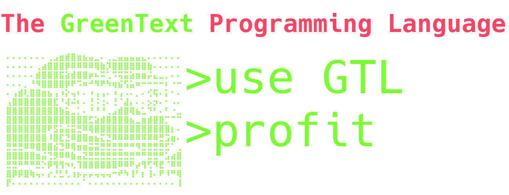

# GreenTextLang
The **GreenText Programming Language** or **GTL** for short is a multi-paradigm programming language designed in such a way that
functional code ]written in it resembles the style of classical internet copypasta, more specifically green text posts found
on meme imageboards with notable mention of (now defunct) 4chan.

While it is not intended to be taken completely seriously, it is a fully fledged language.
However we often sacrificed some of the more advanced features and ease of use for the sake of resemblance to the original style and thus do not recommend using it for production code.

### Implementation:
This is a **Java** implementation of the interpreter for the language using the **ANTLR4**.


## 📦 Installation guide
### Requirements
- **Java 1.8** (must be available in your system's `PATH`)
- Windows, Linux, or macOS terminal access

#### 1. Install Java
The following instructions are fore the **MINIMAL REQUIRED** java version, in that case v1.8.
We highly recommend using the latest LTS version of Java.

Check if Java 1.8 is already installed:
```sh
java -version
```

If not installed:\
Download Java 1.8 from the Oracle Java Archive or another trusted source.\
Add Java's bin directory to your system's PATH.

#### 2. Download the App
Go to the Releases section of this repository.\
Download the latest release.\
Unzip it to desired folder.\
Interpreter is GTL.exe file in bin folder.

#### 3. (Optional) Associate .gtl File Extension (Windows Only)
To make .gtl files open widows Settings/Apps/Default Apps\
Search for .gtl.\
Click Choose default and navigate to GTL.exe file.

## Run Tutorial

Navigate to bin folder and fun command line. From command line run:
```sh
gtl path/to/file
```
Options:
 - -h - help
 - -d - turn on debug mode
 - -v - show version of GTL

## 🐞 Debugger Tutorial
When the debugger is running, the following commands are available:

Command	Description
- *ENTER*	          - to the next step (step forward)
- **number**	      - Go forward number of lines
- line **number**	  - Equivalent to entering the number directly
- resize then *ENTER* - Recalculates display size (use if output looks misaligned)
- clear	              - Clears the program output window

## License

## 🧍Credits🧍
This implementation of GreenTextLang started as a college project for the compilation theory course by the following team:
- Project lead and main developer - **[Mateusz Kotarba](https://github.com/komumati1)**
- Lead language designer and developer - **[Juliusz Kociński](https://github.com/Julczyk)**
- Developer and main tester - **[Jakub Kierznowski](https://github.com/qualv13)**